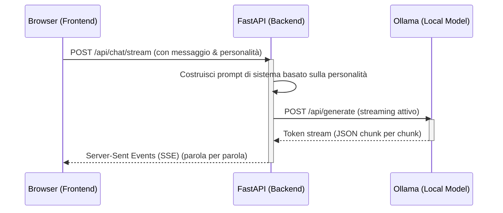

# Architettura Athena AI - v0.1 (Chat AI Locale)

Athena v0.1 è progettata come un'applicazione a tre livelli:
1. **Frontend (Next.js/React/TS)**: Fornisce l'interfaccia chat premium, gestisce lo stato locale (storico chat in locale per fallback, preferenze dell'utente) e consuma le API streaming dal backend.
2. **Backend (FastAPI/Python)**: Espone gli endpoint per la gestione della sessione chat, la formattazione dei prompt di sistema (personalità) e coordina lo streaming delle risposte collegandosi a Ollama.
3. **Inference Engine (Ollama)**: Esegue il modello linguistico in locale.

## Flusso dei Dati (Inference)

## Struttura della Memoria (v0.1)
- **Short-term Memory**: Mantenuta nel contesto della conversazione inviata ad ogni richiesta.
- **Database**: SQLite locale (`athena.db`) per salvare lo storico delle chat e le configurazioni delle personalità dell'utente, consentendo una facile transizione a PostgreSQL in v0.5.
